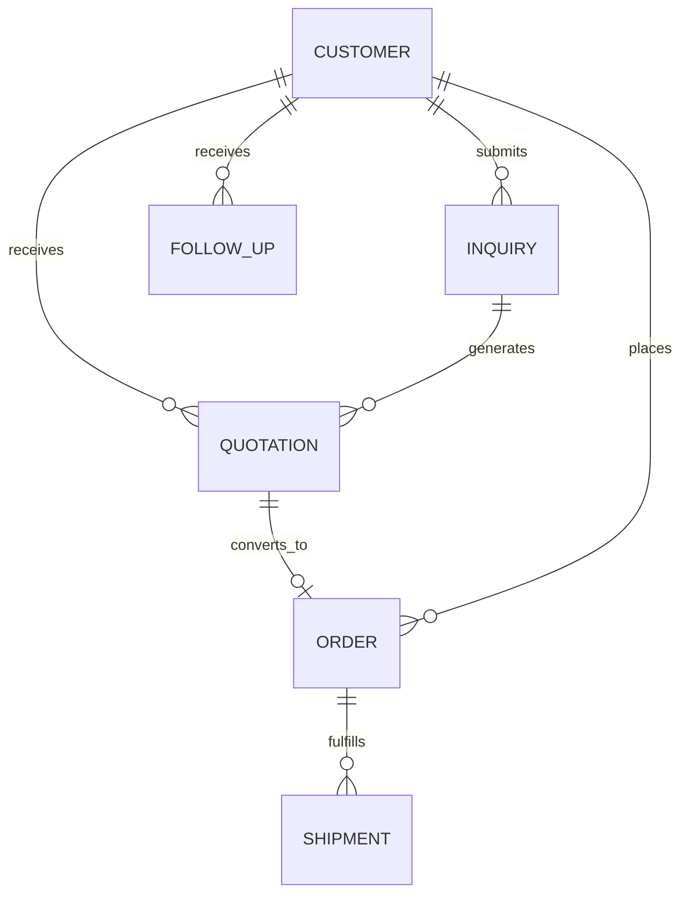

# RichLand CRM — Data Dictionary

## Purpose and implementation note

This dictionary defines the logical relational model used for business analysis and the planned normalized database structure.

The current prototype uses Prisma with `StoreCollection` payloads as a bridge for operational collections. It is not accurate to describe every logical entity below as a physical Prisma table today. The production migration plan separates these entities and enforces database-level relations.

> Demonstration data has been anonymized or synthetically generated.

## Relationship summary

## Status reference

| Entity | Allowed values for case-study scope |
|---|---|
| Inquiry | `NEW`, `REVIEWING`, `QUALIFIED`, `CLOSED` |
| Follow-Up | `OPEN`, `DONE`, `CANCELLED` |
| Quotation | `DRAFT`, `UNDER_REVIEW`, `SENT`, `ACCEPTED`, `REJECTED`, `EXPIRED` |
| Order | `PO_REVIEW`, `CONFIRMED`, `IN_PRODUCTION`, `READY_TO_SHIP`, `SHIPPED`, `CANCELLED` |
| Shipment | `PLANNING`, `BOOKED`, `CUSTOMS_READY`, `ON_BOARD`, `COMPLETED` |

## Customers

| Field | Type | Key / required | Definition | Validation |
|---|---|---|---|---|
| `customer_id` | UUID | PK, required | Stable internal customer identifier | System-generated; immutable |
| `company_name` | Text | Required | Customer organization name | Trimmed; 2–160 characters |
| `primary_email` | Text | Required | Main commercial contact email | Valid email; normalized lowercase |
| `website` | Text | Optional | Customer company website | Valid HTTP(S) URL when provided |
| `destination_market` | Text | Required | Primary country or sales market | Controlled country/market reference |
| `created_at` | DateTime | Required | Record creation timestamp | System-generated UTC |
| `updated_at` | DateTime | Required | Latest record update timestamp | System-maintained UTC |

Business uniqueness is evaluated using normalized company name, email/domain, and destination market. Potential duplicates are flagged rather than silently merged.

## Inquiries

| Field | Type | Key / required | Definition | Validation |
|---|---|---|---|---|
| `inquiry_id` | UUID | PK, required | Stable inquiry identifier | System-generated; immutable |
| `customer_id` | UUID | FK, required | Related customer | Must exist in Customers |
| `contact_id` | UUID | FK, optional | Related customer contact | Must belong to the same customer |
| `source` | Enum | Required | Intake source | `WEBSITE`, `EMAIL`, `MANUAL`, `REFERRAL` |
| `status` | Enum | Required | Qualification state | See status reference |
| `target_category` | Text | Required | Requested product category | Controlled catalog category |
| `estimated_quantity` | Integer | Optional | Buyer-estimated units | Positive whole number |
| `destination_market` | Text | Required | Intended destination market | Country/market reference |
| `cooperation_mode` | Enum | Optional | OEM / ODM / distribution intent | Controlled values |
| `message` | Text | Optional | Buyer notes | Maximum 4,000 characters |
| `created_at` | DateTime | Required | Submission timestamp | System-generated UTC |
| `updated_at` | DateTime | Required | Latest update timestamp | System-maintained UTC |

## Follow-Ups

| Field | Type | Key / required | Definition | Validation |
|---|---|---|---|---|
| `follow_up_id` | UUID | PK, required | Stable action identifier | System-generated; immutable |
| `customer_id` | UUID | FK, required | Customer receiving the action | Must exist in Customers |
| `inquiry_id` | UUID | FK, optional | Originating inquiry | Must belong to the same customer |
| `quotation_id` | UUID | FK, optional | Related quotation | Must belong to the same customer |
| `owner_user_id` | UUID | FK, required | Responsible internal user | Active internal user only |
| `action_type` | Enum | Required | Next-action category | `CALL`, `EMAIL`, `DOCUMENT`, `REVIEW`, `OTHER` |
| `due_at` | DateTime | Required | Expected completion date/time | Valid timestamp |
| `status` | Enum | Required | Action state | `OPEN`, `DONE`, `CANCELLED` |
| `outcome` | Text | Optional | Result of completed action | Required when status is `DONE` |
| `completed_at` | DateTime | Optional | Completion timestamp | Required when status is `DONE` |
| `created_at` | DateTime | Required | Creation timestamp | System-generated UTC |
| `updated_at` | DateTime | Required | Latest update timestamp | System-maintained UTC |

Derived rule: `is_overdue = status = OPEN AND due_at < snapshot_time`.

## Quotations

| Field | Type | Key / required | Definition | Validation |
|---|---|---|---|---|
| `quotation_id` | UUID | PK, required | Stable quotation record ID | System-generated; immutable |
| `quotation_number` | Text | Required | Stable human-readable business number shared by its revisions | Controlled pattern; uniqueness enforced with `version` |
| `customer_id` | UUID | FK, required | Recipient customer | Must exist in Customers |
| `inquiry_id` | UUID | FK, required | Source inquiry | Must belong to same customer |
| `version` | Integer | Composite unique, required | Document revision | Must equal the highest existing version + 1 for the same inquiry |
| `currency` | Enum | Required | Commercial currency | ISO 4217 code |
| `total_value` | Decimal | Required | Quotation total | Non-negative; fixed decimal type |
| `valid_until` | Date | Optional in prototype | Commercial expiry date | When present, must be valid and on or after `created_at` date |
| `moq` | Integer | Optional | Minimum order quantity | Positive whole number |
| `lead_time` | Text | Required | Quoted production lead time | Controlled text or duration |
| `incoterm` | Enum | Required | Trade term | Supported Incoterm code only |
| `status` | Enum | Required | Commercial lifecycle state | See status reference |
| `sales_owner_id` | UUID | FK, required | Responsible sales user | Active sales-capable user |
| `created_at` | DateTime | Required | Creation timestamp | System-generated UTC |
| `updated_at` | DateTime | Required | Latest update timestamp | System-maintained UTC |

## Orders

| Field | Type | Key / required | Definition | Validation |
|---|---|---|---|---|
| `order_id` | UUID | PK, required | Stable order identifier | System-generated; immutable |
| `order_number` | Text | Unique, required | Human-readable order number | Unique; controlled pattern |
| `customer_id` | UUID | FK, required | Ordering customer | Must exist in Customers |
| `quotation_id` | UUID | FK, required | Accepted commercial source | Quotation must belong to same customer |
| `customer_po_id` | UUID | FK, required | Customer purchase order | Must pass PO review before confirmation |
| `status` | Enum | Required | Internal order state | See status reference |
| `customer_visible_status` | Enum | Required | Simplified external milestone | Must map from internal state |
| `order_value` | Decimal | Required | Accepted commercial total | Non-negative; same currency context |
| `production_status` | Enum | Required | Factory execution state | Controlled workflow values |
| `docs_status` | Enum | Required | Export document readiness | Controlled workflow values |
| `created_at` | DateTime | Required | Creation timestamp | System-generated UTC |
| `updated_at` | DateTime | Required | Latest update timestamp | System-maintained UTC |

## Shipments

| Field | Type | Key / required | Definition | Validation |
|---|---|---|---|---|
| `shipment_id` | UUID | PK, required | Stable shipment identifier | System-generated; immutable |
| `order_id` | UUID | FK, required | Related order | Must exist in Orders |
| `status` | Enum | Required | Shipment lifecycle state | See status reference |
| `trade_terms` | Enum | Required | Shipment trade terms | Must align with approved order |
| `port_of_loading` | Text | Required | Planned loading port | Controlled port reference |
| `shipment_window_start` | Date | Required | Earliest planned ship date | Valid date |
| `shipment_window_end` | Date | Required | Latest planned ship date | On or after start date |
| `booking_reference` | Text | Optional | Carrier booking reference | Required from `BOOKED` onward |
| `packaging_confirmed` | Boolean | Required | Packaging readiness flag | Default false |
| `marks_confirmed` | Boolean | Required | Shipping mark readiness flag | Default false |
| `created_at` | DateTime | Required | Creation timestamp | System-generated UTC |
| `updated_at` | DateTime | Required | Latest update timestamp | System-maintained UTC |

## Source-backed operational extensions

| Entity | Primary key | Important foreign keys / fields | Truth-status rule |
|---|---|---|---|
| SourceDocument | `source_document_id` | document type, document date, reviewed pages, verification status | Identifies anonymized source evidence and its review boundary |
| OrderLineItem | `order_line_item_id` | `order_id`, model, color, quantity, containers, unit price, line value | Source quantity may coexist with explicitly synthetic price and value |
| DispatchBatch | `dispatch_batch_id` | `order_id`, batch number, cutoff date, containers, planned units | Source-backed planning grain |
| ShipmentLineItem | `shipment_line_item_id` | `shipping_plan_id`, model, color, shipped quantity | Source-backed execution grain; never forced to equal a planned batch |
| PaymentRecord | `payment_record_id` | `order_id`, payment type, amount, received date | Synthetic in the public commercial scenario |
| ProductionTask | `production_task_id` | `order_id`, planned / actual dates, status | Synthetic in the public commercial scenario |

### Provenance controls

- `source_backed_anonymized` is used only for facts transcribed and reconciled from supplied documents.
- `synthetically_generated` is used for customer, destination, price, quotation, PI, payment, production, and annual-portfolio records created for demonstration.
- Finished-product quantity, cartons, CBM, net weight, gross weight, and BOM component quantity are distinct measures.
- The 56,480-unit plan and 17,132-unit shipment share an order relationship but remain separate planning and execution records.

## KPI definitions

| KPI | Definition | Exclusions |
|---|---|---|
| Open quotations | Count of quotations in `DRAFT`, `SENT`, or `UNDER_REVIEW` | Accepted, rejected, expired |
| Pending follow-ups | Count of Follow-Ups with status `OPEN` | Done, cancelled |
| Orders by status | Count of non-cancelled Orders grouped by current internal status | Cancelled |
| Monthly order value | Sum of `order_value` grouped by order-created month | Cancelled orders |
| Quotation-to-order conversion | Accepted quotations divided by issued quotations | Draft quotations from denominator |
| Overdue follow-ups | Open Follow-Ups with `due_at` earlier than snapshot time | Done, cancelled, future due dates |

