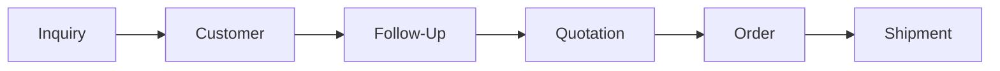
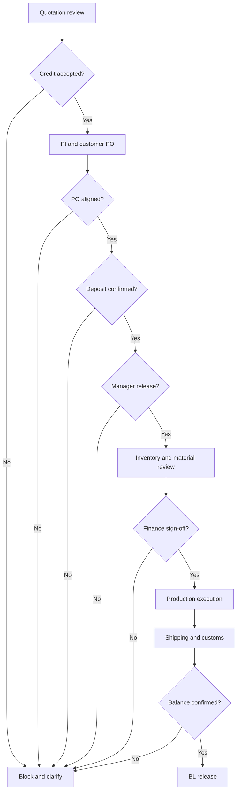

# RichLand Inquiry-to-Shipment Workflow Specification

## Recruiter view

This six-stage view is deliberately simple. The implementation retains more internal gates so the customer-visible story can stay clear without hiding operational control from employees.

## Stage definitions

| Stage | Owner | Input | Key activity | Output | Primary blocker |
|---|---|---|---|---|---|
| Inquiry | Sales | Website/email/manual request | Validate demand and qualification fields | Stored inquiry with owner/context | Missing contact or demand information |
| Customer | Sales | Valid inquiry | Match/create customer and contact | Linked customer history | Suspected duplicate requires review |
| Follow-Up | Sales | Qualified customer/inquiry | Assign next action and due date | Completed action or next task | Missing owner or overdue open task |
| Quotation | Sales + Finance | Qualified demand | Prepare versioned offer and review terms | Sent/accepted quotation | Invalid dates, credit posture, incomplete pricing |
| Order | Sales + Manager + Finance | Accepted quote, PI, customer PO | Review document alignment and required approvals | Released order execution | PO mismatch, missing deposit, missing approval/sign-off |
| Shipment | Production + Documentation + Finance | Released and completed order | Confirm readiness, booking, customs, balance, and document release | Completed customer milestone | Not ready, missing documents, unpaid balance |

## Detailed internal control path

## Automation rules

| Rule | Trigger | Condition | Action | Owner |
|---|---|---|---|---|
| AUTO-01 | Inquiry stored | New or reviewing | Create sales review task | Sales |
| AUTO-02 | Follow-up clock | Status open and due timestamp passed | Mark/show as overdue and place in owner queue | Sales |
| AUTO-03 | Quotation sent | No customer response by reminder date | Create follow-up reminder | Sales |
| AUTO-04 | PO uploaded | Required references present | Create PO review task | Sales / operations |
| AUTO-05 | PO approved | Deposit not confirmed | Keep execution blocked; create finance action | Finance |
| AUTO-06 | Deposit confirmed | Manager release pending | Create approval task | General Manager |
| AUTO-07 | Missing materials found | Cost impact present | Create cost review and finance sign-off tasks | Manager / Finance |
| AUTO-08 | Production completed | Shipment requirements ready | Open shipping/documentation queue | Documentation |
| AUTO-09 | Shipment on board | Balance not confirmed | Create payment follow-up; block BL release | Finance |
| AUTO-10 | Balance confirmed | All document gates passed | Allow BL release and record audit event | Documentation / Finance |

## Customer-visible mapping

| Internal states | Customer-visible milestone |
|---|---|
| Inquiry review, credit review, quotation preparation | Request under review |
| Quotation sent, PI prepared, PO review | Commercial confirmation |
| Deposit confirmed, manager/finance release | Order confirmed |
| Production released / in progress | In production |
| Ready to ship, booking, customs | Preparing shipment |
| On board, balance/document gate | Shipped / documents pending |
| BL released and workflow completed | Completed |

Internal approval comments, credit assessments, and exception detail are not exposed to customers.

## Exception behavior

- A blocked case retains its current valid stage.
- The response identifies the missing evidence or approval.
- A responsible role receives or retains an action item.
- The blocked attempt leaves workflow or audit evidence.
- No later queue is opened through a silent status jump.

